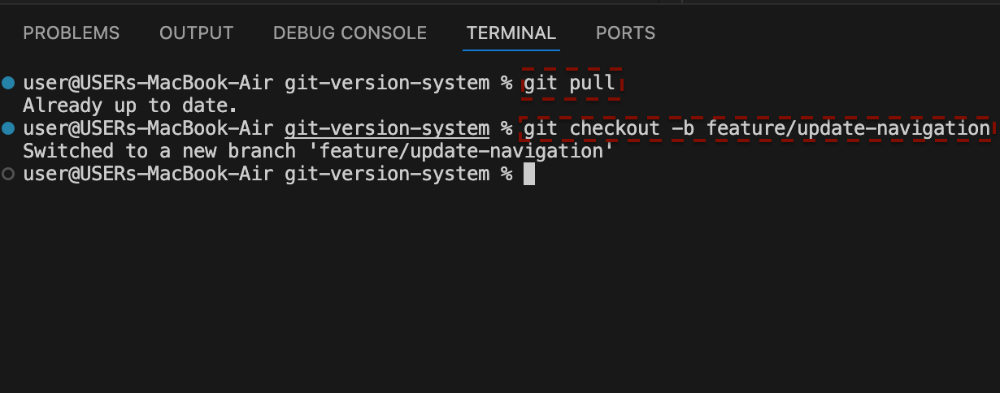
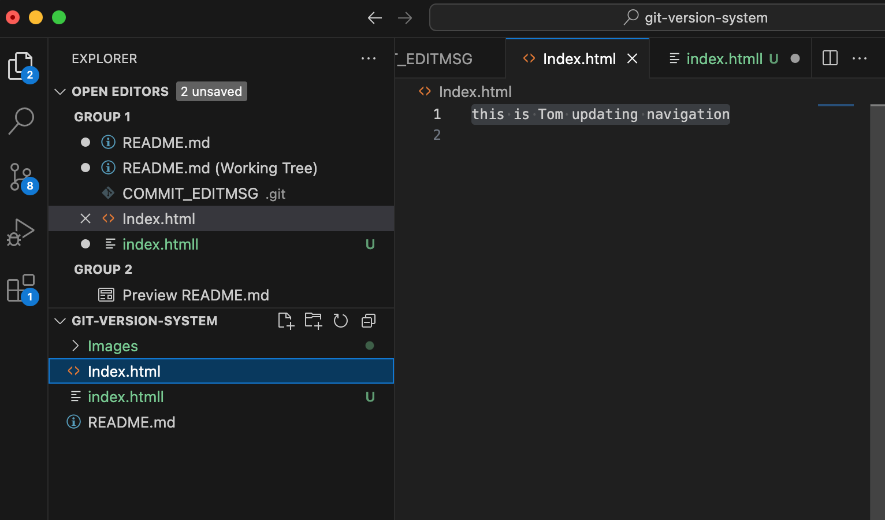
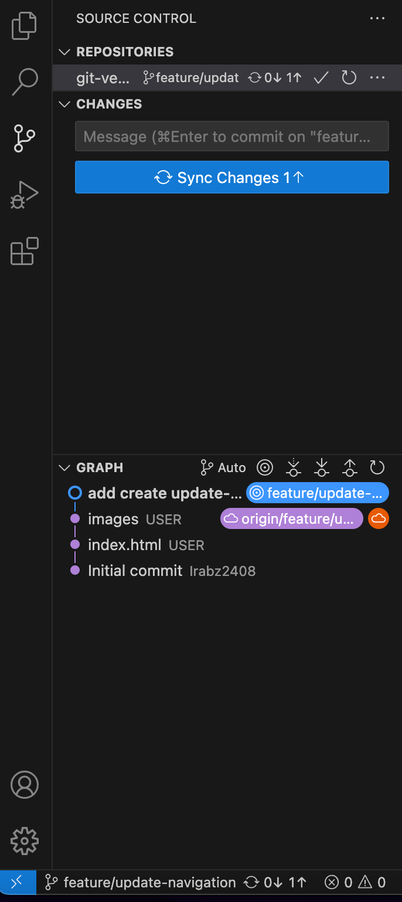
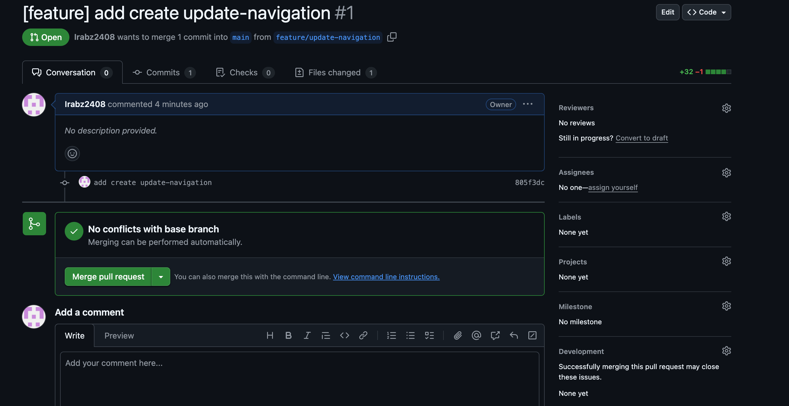

# # GIT-VERSION-SYSTEM

* ## On this project i will be ilustrating how two people be working one a the same project at the same time without overriding each based code with version control system (GIT)

1. ## Intial setup 

2. ## Tom and jerry starts working 
* this where tom and jerry pull the lastest changes on the index.html file.

 * ## Heres is where the clone was sucessful

* also they both create a new branch for their main project where tom branch will be named "update-navigation" while jerry will be named add-contact-info

3. ## Making changes
* On his branch,tom updates the navigations bar in index.html 

* also follow the due process of commit 

4. ##  Making changes
* One his branch,jerry  updates the navigations bar in index.html 
 

5. ## Merging changes 
* once they are done. tom and jerry push their branches to central resporitory

* tom decides to mergres his first. he creates a "pull request" his branch "update - navigation" . PR is a way to tell the team that he's done and the code is ready to review

